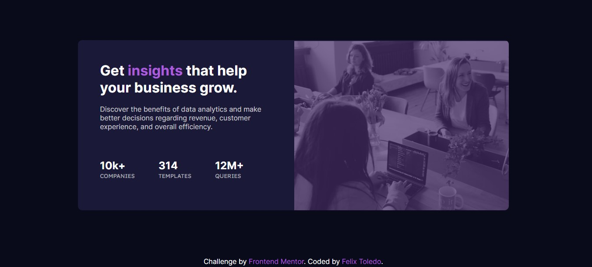

# Frontend Mentor - Stats preview card component solution

This is a solution to the [Stats preview card component challenge on Frontend Mentor](https://www.frontendmentor.io/challenges/stats-preview-card-component-8JqbgoU62). 

This solution was made with HTML, and SCSS.

## Table of contents

- [Overview](#overview)
  - [The challenge](#the-challenge)
  - [Screenshot](#screenshot)
  - [Links](#links)
- [My process](#my-process)
  - [Built with](#built-with)
  - [What I learned](#what-i-learned)
  - [Useful resources](#useful-resources)
- [Author](#author)

## Overview

### The challenge

Users should be able to:

- View the optimal layout depending on their device's screen size

### Screenshot
Desktop:

Mobile:

### Links

- Solution URL: [CODE](https://github.com/felix-toledo/stats-card-challenge-frontendmentor)
- Live Site URL: [DEPLOYMENT](https://felix-toledo.github.io/stats-card-challenge-frontendmentor/)

## My process

### Built with

- Semantic HTML5 markup
- CSS custom properties
- Flexbox
- CSS Grid
- Mobile-first workflow
- SCSS

### What I learned

The most I learned was how to put a violet filter to your images.

.img-mobile{
        visibility: visible;
        width: 100%;
        filter: opacity(0.3) drop-shadow(0 0 0 $accent); 
    }

### Useful resources

- [RESOURCE OF WHAT I LEARNED](https://www.delftstack.com/es/howto/css/css-change-image-color/) - This helped me for teaching me how to put a filter.

## Author

- GitHub - [Felix Toledo](https://github.com/felix-toledo)
- Frontend Mentor - [@felix-toledo](https://www.frontendmentor.io/profile/felix-toledo)
- Twitter - [@_felixtoledo](https://www.twitter.com/_felixtoledo)

